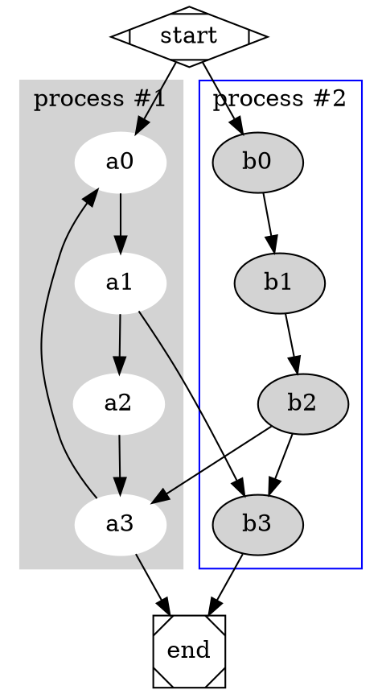

here's a test post[^1]

[^1]: test as in freedom

example from [dreampuf.github.io/graphvizonline](https://dreampuf.github.io/GraphvizOnline)



## Example code

[example haskell code from here](https://www.haskellforall.com/2015/10/basic-haskell-examples.html)

```haskell
putTodo :: (Int, String) -> IO ()
putTodo (n, todo) = putStrLn (show n ++ ": " ++ todo)

prompt :: [String] -> IO ()
prompt todos = do
    putStrLn ""
    putStrLn "Current TODO list:"
    mapM_ putTodo (zip [0..] todos)
    command <- getLine
    interpret command todos

interpret :: String -> [String] -> IO ()
interpret ('+':' ':todo) todos = prompt (todo:todos)
interpret ('-':' ':num ) todos =
    case delete (read num) todos of
        Nothing -> do
            putStrLn "No TODO entry matches the given number"
            prompt todos
        Just todos' -> prompt todos'
interpret  "q"           todos = return ()
interpret  command       todos = do
    putStrLn ("Invalid command: `" ++ command ++ "`")
    prompt todos

delete :: Int -> [a] -> Maybe [a]
delete 0 (_:as) = Just as
delete n (a:as) = do
    as' <- delete (n - 1) as
    return (a:as')
delete _  []    = Nothing

main = do
    putStrLn "Commands:"
    putStrLn "+ <String> - Add a TODO entry"
    putStrLn "- <Int>    - Delete the numbered entry"
    putStrLn "q          - Quit"
    prompt []
```

